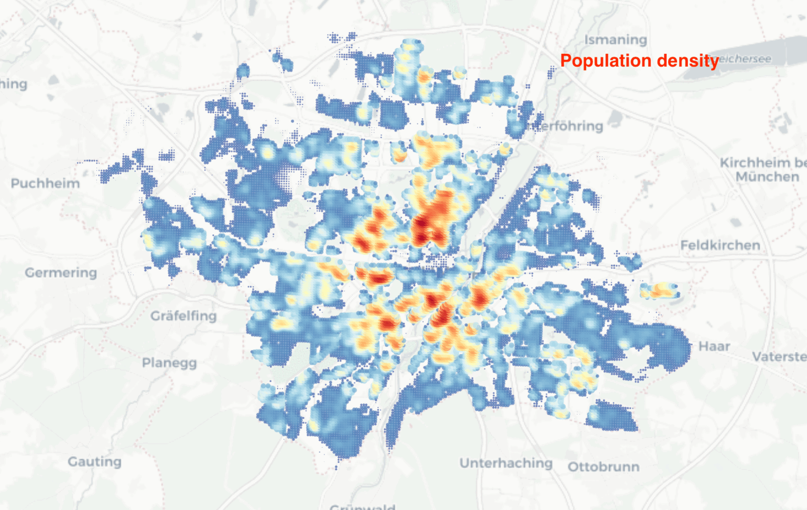
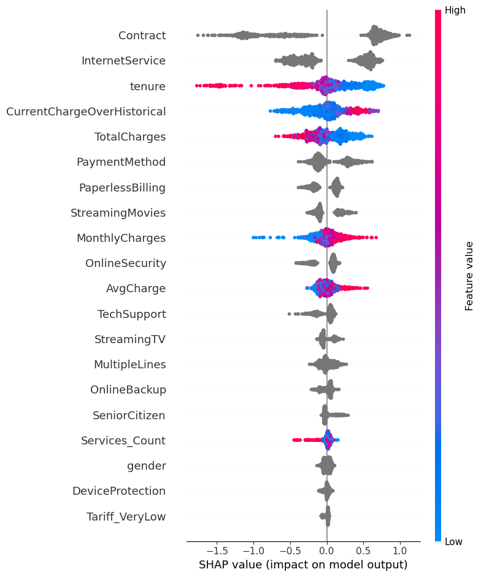
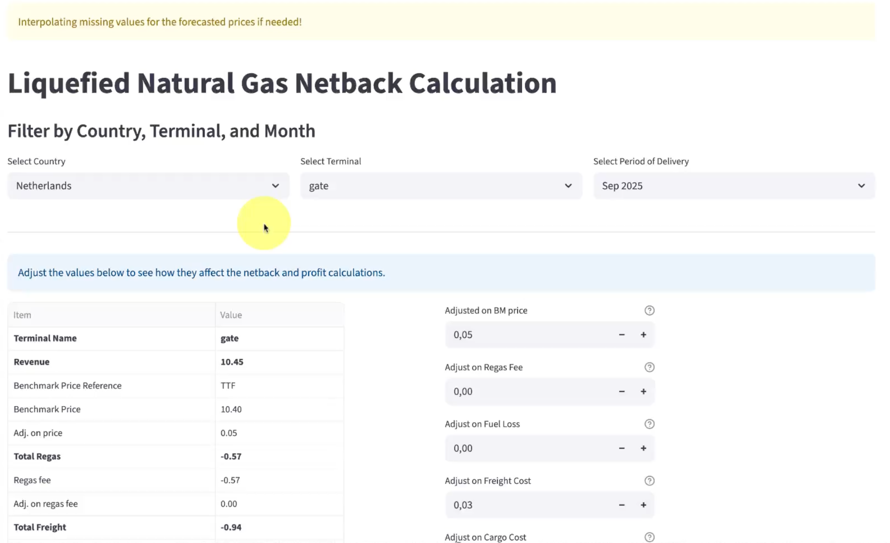

# Data science projects

## Introduction

This workspace is a curated collection of small-to-medium end-to-end data science projects intended for portfolio presentation and reproducible analysis. Each subfolder contains notebooks, data samples or scripts that walk through data ingestion, preprocessing, exploratory analysis, modeling, and lightweight deployment (visualization or dashboard).

The projects are organized so a reviewer can quickly find a narrative and the code required to reproduce key results. Where relevant, notebooks include a short "Quick run" recommendation and pointers to reduce runtime for reviewers who want a fast preview.

## Finding the Best Locations for New Supermarkets in Munich

This project demonstrates a full data science workflow to identify high-opportunity locations for new supermarket openings in Munich. It combines automated data collection, spatial data integration, and advanced modeling to support data-driven retail expansion decisions.

**Key features:**

- Automated supermarket location data collection in the Munich area using the Google Places API
- Integration of high-resolution, publicly available population data on a 100m grid
- Data cleaning, standardization, and spatial visualization
- Two opportunity scoring models:
   1. Model I: Opportunity score = population × distance to nearest supermarket
   2. Model II: Opportunity score = population density (KDE) divided by store density (KDE)
- Interactive visualizations and actionable insights for optimal supermarket placement

This project is ideal for demonstrating spatial data science, geospatial analysis, and business impact in a real-world context.

## Revenue Forecasting, Segmentation, and Price Impact Analysis

This work demonstrates a comprehensive data science workflow for a global direct selling company. It covers:

- **Revenue Forecasting:** Predicting future revenue for each customer and region using time series and machine learning models.
- **Customer Segmentation:** Grouping customers by business behaviors and growth to enable targeted marketing and retention strategies.
- **Price Impact Analysis:** Evaluating the effect of a price increase on buyer behavior, providing actionable insights for pricing strategy.

The project emphasizes data validation, robust modeling, and clear communication of business impact—showcasing end-to-end data science skills for real-world decision support.

## Telco Customer Churn Prediction

Predict which telecom customers are most likely to churn and surface the business drivers so retention teams can take action. The notebook walks through EDA, feature engineering, baseline and advanced models (Logistic Regression, Random Forest, CatBoost), hyperparameter tuning, model comparison, an ensemble, and SHAP explainability.

## Sarcasm Detector (Fake_news_detector)

Detect sarcasm and misleading headlines using headline text only. This project demonstrates an end-to-end classification experiment comparing simple, fast baselines with more advanced embedding and transformer approaches.

**Key features:**

- Dataset loading and conservative cleaning to avoid conflicting labels and duplicates.
- Reusable text-preprocessing utilities (HTML stripping, contraction expansion, hyphen normalization, zero-width space removal, optional lemmatization and stopword control).
- Baseline and comparative models: TF‑IDF + Logistic Regression, FastText averaged embeddings + LR, a BiGRU sequence model, and a BERT fine-tuning sketch.
- Systematic experiments showing how preprocessing choices affect performance, and evaluation using classification reports and confusion matrices.

## Natural Gas Price Forecasting

A reproducible workflow to forecast major natural gas price benchmarks (Henry Hub, TTF, PSV, JKM) using classical time-series methods and modern neural forecasting tools, including auto-arima, Prophet, N-Beats, TFT, and TimeGPT.

<!-- # 

<iframe width="560" height="315" src="https://www.youtube.com/embed/fwuZ7F4Wf8Y?si=O96V4G9epO3Mxjic&amp;controls=0" title="YouTube video player" frameborder="0" allow="accelerometer; autoplay; clipboard-write; encrypted-media; gyroscope; picture-in-picture; web-share" referrerpolicy="strict-origin-when-cross-origin" allowfullscreen></iframe> -->